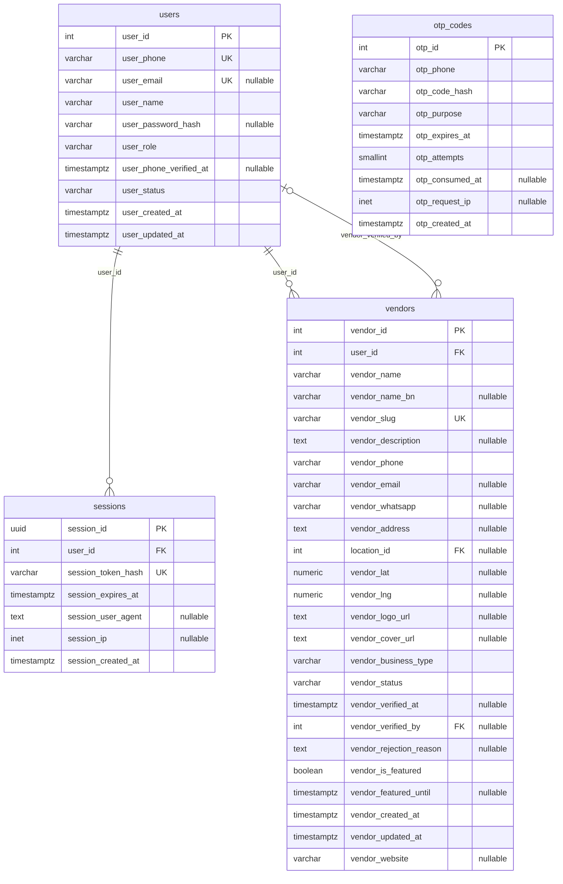
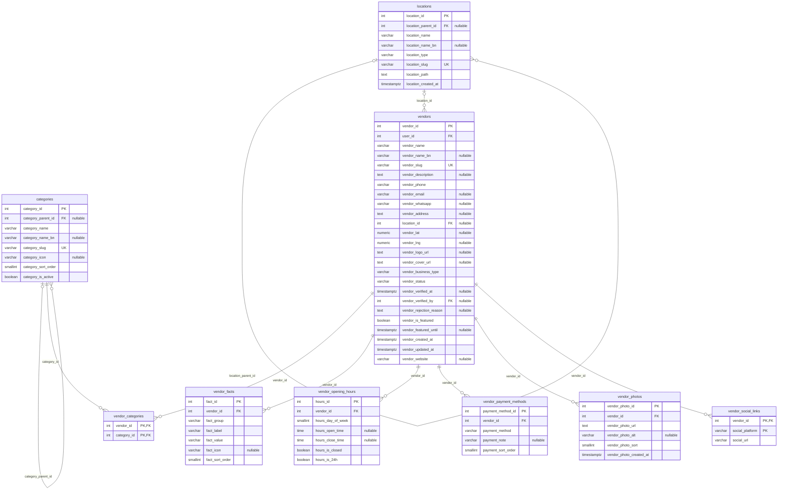
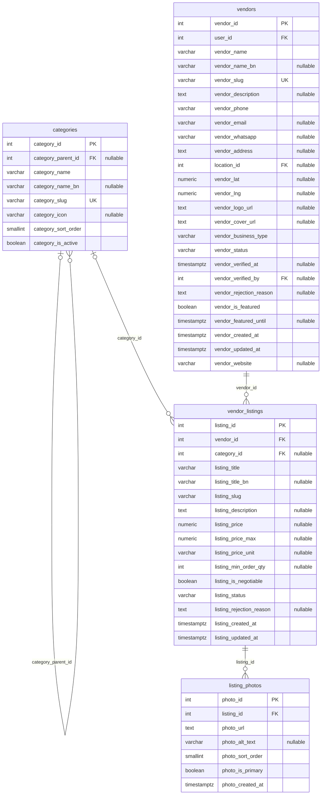
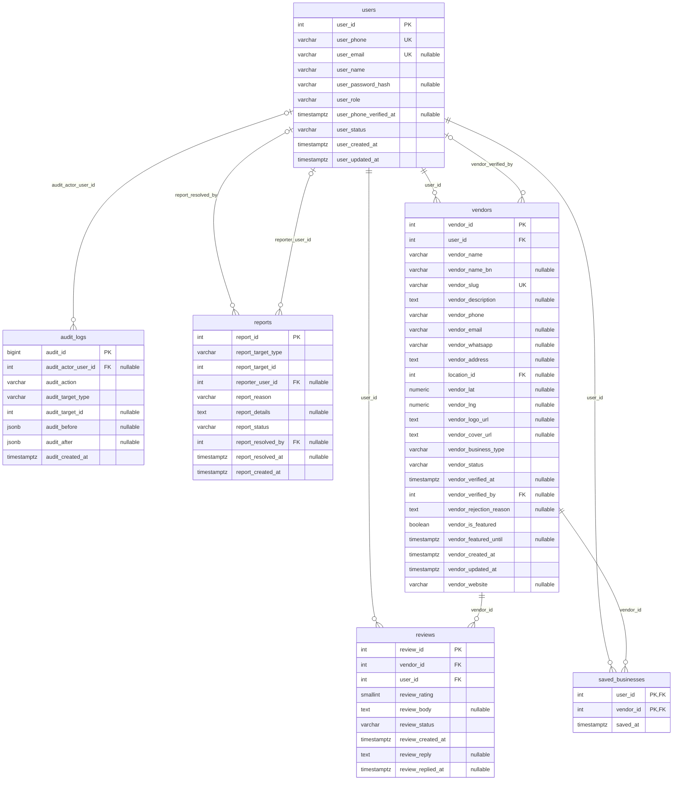
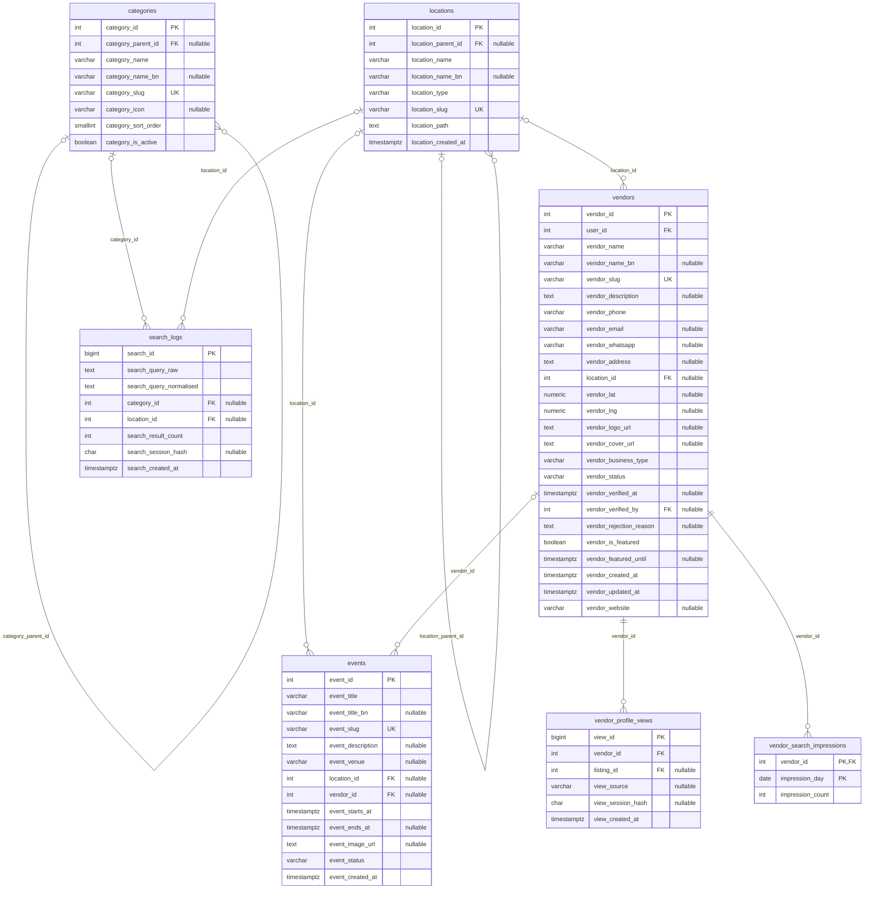

# Shahebbazar — ER diagram

<!-- Generated by backend/scripts/generate-erd.js. Do not edit by hand: run `npm run docs:erd`. -->

Generated from the live PostgreSQL schema: **27 tables**, **44 foreign keys** and **4 views** (`v_active_users_daily`, `v_business_cards`, `v_moderation_queue`, `v_search_trends_daily`; views are not drawn).

How to read it: `PK` primary key, `FK` foreign key, `UK` unique. Each line joins a parent (left) to a child (right):
`||--o{` one parent to many children, `o|--o{` optional parent, `||--o|` one-to-one. The label is the foreign-key column.

The schema itself, with the reasoning behind each table, is in `database/schema.v2*.sql` and `database/SCHEMA-NOTES.md`.

## 1. Accounts and sign-in

Phone number is the account identifier; one account can own several businesses.



## 2. Businesses

Everything a business profile shows. Only approved businesses are public.



## 3. Products and services

Listings and their photos. Only approved listings are public.



## 4. Quotations and messaging

Request for quote, the vendor's response, and buyer/seller conversations.

```mermaid
erDiagram
    vendor_listings o|--o{ conversations : "listing_id"
    quote_requests o|--o{ conversations : "rfq_id"
    users ||--o{ conversations : "user_id"
    vendors ||--o{ conversations : "vendor_id"
    conversations ||--o{ messages : "conversation_id"
    users ||--o{ messages : "sender_user_id"
    users ||--o{ notifications : "user_id"
    vendor_listings o|--o{ quote_requests : "listing_id"
    users o|--o{ quote_requests : "user_id"
    vendors o|--o{ quote_requests : "vendor_id"
    quote_requests ||--o{ quote_responses : "rfq_id"
    vendors ||--o{ quote_responses : "vendor_id"
    vendors ||--o{ vendor_listings : "vendor_id"
    users ||--o{ vendors : "user_id"
    users o|--o{ vendors : "vendor_verified_by"
    conversations {
        int conversation_id PK
        int vendor_id FK
        int user_id FK
        int listing_id FK "nullable"
        int rfq_id FK "nullable"
        varchar conversation_status
        timestamptz conversation_created_at
        timestamptz conversation_last_message_at "nullable"
    }
    messages {
        int message_id PK
        int conversation_id FK
        int sender_user_id FK
        text message_body
        timestamptz message_read_at "nullable"
        timestamptz message_created_at
    }
    notifications {
        int notification_id PK
        int user_id FK
        varchar notification_type
        varchar notification_channel
        jsonb notification_payload
        varchar notification_status
        text notification_error "nullable"
        timestamptz notification_sent_at "nullable"
        timestamptz notification_read_at "nullable"
        timestamptz notification_created_at
    }
    quote_requests {
        int rfq_id PK
        varchar rfq_public_ref UK
        int user_id FK "nullable"
        varchar rfq_contact_name
        varchar rfq_contact_phone
        varchar rfq_contact_email "nullable"
        int vendor_id FK "nullable"
        int listing_id FK "nullable"
        int category_id FK "nullable"
        varchar rfq_title
        text rfq_details "nullable"
        numeric rfq_quantity "nullable"
        varchar rfq_unit "nullable"
        numeric rfq_target_price "nullable"
        date rfq_needed_by "nullable"
        int rfq_delivery_location_id FK "nullable"
        varchar rfq_status
        timestamptz rfq_created_at
        timestamptz rfq_expires_at "nullable"
    }
    quote_responses {
        int quote_id PK
        int rfq_id FK
        int vendor_id FK
        numeric quote_price
        char quote_currency
        int quote_lead_time_days "nullable"
        varchar quote_payment_terms
        text quote_notes "nullable"
        date quote_valid_until "nullable"
        varchar quote_status
        timestamptz quote_created_at
    }
    users {
        int user_id PK
        varchar user_phone UK
        varchar user_email UK "nullable"
        varchar user_name
        varchar user_password_hash "nullable"
        varchar user_role
        timestamptz user_phone_verified_at "nullable"
        varchar user_status
        timestamptz user_created_at
        timestamptz user_updated_at
    }
    vendor_listings {
        int listing_id PK
        int vendor_id FK
        int category_id FK "nullable"
        varchar listing_title
        varchar listing_title_bn "nullable"
        varchar listing_slug
        text listing_description "nullable"
        numeric listing_price "nullable"
        numeric listing_price_max "nullable"
        varchar listing_price_unit "nullable"
        int listing_min_order_qty "nullable"
        boolean listing_is_negotiable
        varchar listing_status
        text listing_rejection_reason "nullable"
        timestamptz listing_created_at
        timestamptz listing_updated_at
    }
    vendors {
        int vendor_id PK
        int user_id FK
        varchar vendor_name
        varchar vendor_name_bn "nullable"
        varchar vendor_slug UK
        text vendor_description "nullable"
        varchar vendor_phone
        varchar vendor_email "nullable"
        varchar vendor_whatsapp "nullable"
        text vendor_address "nullable"
        int location_id FK "nullable"
        numeric vendor_lat "nullable"
        numeric vendor_lng "nullable"
        text vendor_logo_url "nullable"
        text vendor_cover_url "nullable"
        varchar vendor_business_type
        varchar vendor_status
        timestamptz vendor_verified_at "nullable"
        int vendor_verified_by FK "nullable"
        text vendor_rejection_reason "nullable"
        boolean vendor_is_featured
        timestamptz vendor_featured_until "nullable"
        timestamptz vendor_created_at
        timestamptz vendor_updated_at
        varchar vendor_website "nullable"
    }
```

## 5. Reviews, moderation and saved businesses

Customer reviews, reports of bad content, the admin audit trail, and bookmarks.



## 6. Analytics and events

Search logs and profile views feed the admin trends and the provider dashboard. No personal data is stored.



## All tables

Every table and relationship in one diagram. Large; the sections above are easier to read.

```mermaid
erDiagram
    users o|--o{ audit_logs : "audit_actor_user_id"
    categories o|--o{ categories : "category_parent_id"
    vendor_listings o|--o{ conversations : "listing_id"
    quote_requests o|--o{ conversations : "rfq_id"
    users ||--o{ conversations : "user_id"
    vendors ||--o{ conversations : "vendor_id"
    locations o|--o{ events : "location_id"
    vendors o|--o{ events : "vendor_id"
    vendor_listings ||--o{ listing_photos : "listing_id"
    locations o|--o{ locations : "location_parent_id"
    conversations ||--o{ messages : "conversation_id"
    users ||--o{ messages : "sender_user_id"
    users ||--o{ notifications : "user_id"
    categories o|--o{ quote_requests : "category_id"
    vendor_listings o|--o{ quote_requests : "listing_id"
    locations o|--o{ quote_requests : "rfq_delivery_location_id"
    users o|--o{ quote_requests : "user_id"
    vendors o|--o{ quote_requests : "vendor_id"
    quote_requests ||--o{ quote_responses : "rfq_id"
    vendors ||--o{ quote_responses : "vendor_id"
    users o|--o{ reports : "report_resolved_by"
    users o|--o{ reports : "reporter_user_id"
    users ||--o{ reviews : "user_id"
    vendors ||--o{ reviews : "vendor_id"
    users ||--o{ saved_businesses : "user_id"
    vendors ||--o{ saved_businesses : "vendor_id"
    categories o|--o{ search_logs : "category_id"
    locations o|--o{ search_logs : "location_id"
    users ||--o{ sessions : "user_id"
    categories ||--o{ vendor_categories : "category_id"
    vendors ||--o{ vendor_categories : "vendor_id"
    vendors ||--o{ vendor_facts : "vendor_id"
    categories o|--o{ vendor_listings : "category_id"
    vendors ||--o{ vendor_listings : "vendor_id"
    vendors ||--o{ vendor_opening_hours : "vendor_id"
    vendors ||--o{ vendor_payment_methods : "vendor_id"
    vendors ||--o{ vendor_photos : "vendor_id"
    vendor_listings o|--o{ vendor_profile_views : "listing_id"
    vendors ||--o{ vendor_profile_views : "vendor_id"
    vendors ||--o{ vendor_search_impressions : "vendor_id"
    vendors ||--o{ vendor_social_links : "vendor_id"
    locations o|--o{ vendors : "location_id"
    users ||--o{ vendors : "user_id"
    users o|--o{ vendors : "vendor_verified_by"
    audit_logs {
        bigint audit_id PK
        int audit_actor_user_id FK "nullable"
        varchar audit_action
        varchar audit_target_type
        int audit_target_id "nullable"
        jsonb audit_before "nullable"
        jsonb audit_after "nullable"
        timestamptz audit_created_at
    }
    categories {
        int category_id PK
        int category_parent_id FK "nullable"
        varchar category_name
        varchar category_name_bn "nullable"
        varchar category_slug UK
        varchar category_icon "nullable"
        smallint category_sort_order
        boolean category_is_active
    }
    conversations {
        int conversation_id PK
        int vendor_id FK
        int user_id FK
        int listing_id FK "nullable"
        int rfq_id FK "nullable"
        varchar conversation_status
        timestamptz conversation_created_at
        timestamptz conversation_last_message_at "nullable"
    }
    events {
        int event_id PK
        varchar event_title
        varchar event_title_bn "nullable"
        varchar event_slug UK
        text event_description "nullable"
        varchar event_venue "nullable"
        int location_id FK "nullable"
        int vendor_id FK "nullable"
        timestamptz event_starts_at
        timestamptz event_ends_at "nullable"
        text event_image_url "nullable"
        varchar event_status
        timestamptz event_created_at
    }
    listing_photos {
        int photo_id PK
        int listing_id FK
        text photo_url
        varchar photo_alt_text "nullable"
        smallint photo_sort_order
        boolean photo_is_primary
        timestamptz photo_created_at
    }
    locations {
        int location_id PK
        int location_parent_id FK "nullable"
        varchar location_name
        varchar location_name_bn "nullable"
        varchar location_type
        varchar location_slug UK
        text location_path
        timestamptz location_created_at
    }
    messages {
        int message_id PK
        int conversation_id FK
        int sender_user_id FK
        text message_body
        timestamptz message_read_at "nullable"
        timestamptz message_created_at
    }
    notifications {
        int notification_id PK
        int user_id FK
        varchar notification_type
        varchar notification_channel
        jsonb notification_payload
        varchar notification_status
        text notification_error "nullable"
        timestamptz notification_sent_at "nullable"
        timestamptz notification_read_at "nullable"
        timestamptz notification_created_at
    }
    otp_codes {
        int otp_id PK
        varchar otp_phone
        varchar otp_code_hash
        varchar otp_purpose
        timestamptz otp_expires_at
        smallint otp_attempts
        timestamptz otp_consumed_at "nullable"
        inet otp_request_ip "nullable"
        timestamptz otp_created_at
    }
    quote_requests {
        int rfq_id PK
        varchar rfq_public_ref UK
        int user_id FK "nullable"
        varchar rfq_contact_name
        varchar rfq_contact_phone
        varchar rfq_contact_email "nullable"
        int vendor_id FK "nullable"
        int listing_id FK "nullable"
        int category_id FK "nullable"
        varchar rfq_title
        text rfq_details "nullable"
        numeric rfq_quantity "nullable"
        varchar rfq_unit "nullable"
        numeric rfq_target_price "nullable"
        date rfq_needed_by "nullable"
        int rfq_delivery_location_id FK "nullable"
        varchar rfq_status
        timestamptz rfq_created_at
        timestamptz rfq_expires_at "nullable"
    }
    quote_responses {
        int quote_id PK
        int rfq_id FK
        int vendor_id FK
        numeric quote_price
        char quote_currency
        int quote_lead_time_days "nullable"
        varchar quote_payment_terms
        text quote_notes "nullable"
        date quote_valid_until "nullable"
        varchar quote_status
        timestamptz quote_created_at
    }
    reports {
        int report_id PK
        varchar report_target_type
        int report_target_id
        int reporter_user_id FK "nullable"
        varchar report_reason
        text report_details "nullable"
        varchar report_status
        int report_resolved_by FK "nullable"
        timestamptz report_resolved_at "nullable"
        timestamptz report_created_at
    }
    reviews {
        int review_id PK
        int vendor_id FK
        int user_id FK
        smallint review_rating
        text review_body "nullable"
        varchar review_status
        timestamptz review_created_at
        text review_reply "nullable"
        timestamptz review_replied_at "nullable"
    }
    saved_businesses {
        int user_id PK, FK
        int vendor_id PK, FK
        timestamptz saved_at
    }
    search_logs {
        bigint search_id PK
        text search_query_raw
        text search_query_normalised
        int category_id FK "nullable"
        int location_id FK "nullable"
        int search_result_count
        char search_session_hash "nullable"
        timestamptz search_created_at
    }
    sessions {
        uuid session_id PK
        int user_id FK
        varchar session_token_hash UK
        timestamptz session_expires_at
        text session_user_agent "nullable"
        inet session_ip "nullable"
        timestamptz session_created_at
    }
    users {
        int user_id PK
        varchar user_phone UK
        varchar user_email UK "nullable"
        varchar user_name
        varchar user_password_hash "nullable"
        varchar user_role
        timestamptz user_phone_verified_at "nullable"
        varchar user_status
        timestamptz user_created_at
        timestamptz user_updated_at
    }
    vendor_categories {
        int vendor_id PK, FK
        int category_id PK, FK
    }
    vendor_facts {
        int fact_id PK
        int vendor_id FK
        varchar fact_group
        varchar fact_label
        varchar fact_value
        varchar fact_icon "nullable"
        smallint fact_sort_order
    }
    vendor_listings {
        int listing_id PK
        int vendor_id FK
        int category_id FK "nullable"
        varchar listing_title
        varchar listing_title_bn "nullable"
        varchar listing_slug
        text listing_description "nullable"
        numeric listing_price "nullable"
        numeric listing_price_max "nullable"
        varchar listing_price_unit "nullable"
        int listing_min_order_qty "nullable"
        boolean listing_is_negotiable
        varchar listing_status
        text listing_rejection_reason "nullable"
        timestamptz listing_created_at
        timestamptz listing_updated_at
    }
    vendor_opening_hours {
        int hours_id PK
        int vendor_id FK
        smallint hours_day_of_week
        time hours_open_time "nullable"
        time hours_close_time "nullable"
        boolean hours_is_closed
        boolean hours_is_24h
    }
    vendor_payment_methods {
        int payment_method_id PK
        int vendor_id FK
        varchar payment_method
        varchar payment_note "nullable"
        smallint payment_sort_order
    }
    vendor_photos {
        int vendor_photo_id PK
        int vendor_id FK
        text vendor_photo_url
        varchar vendor_photo_alt "nullable"
        smallint vendor_photo_sort
        timestamptz vendor_photo_created_at
    }
    vendor_profile_views {
        bigint view_id PK
        int vendor_id FK
        int listing_id FK "nullable"
        varchar view_source "nullable"
        char view_session_hash "nullable"
        timestamptz view_created_at
    }
    vendor_search_impressions {
        int vendor_id PK, FK
        date impression_day PK
        int impression_count
    }
    vendor_social_links {
        int vendor_id PK, FK
        varchar social_platform PK
        varchar social_url
    }
    vendors {
        int vendor_id PK
        int user_id FK
        varchar vendor_name
        varchar vendor_name_bn "nullable"
        varchar vendor_slug UK
        text vendor_description "nullable"
        varchar vendor_phone
        varchar vendor_email "nullable"
        varchar vendor_whatsapp "nullable"
        text vendor_address "nullable"
        int location_id FK "nullable"
        numeric vendor_lat "nullable"
        numeric vendor_lng "nullable"
        text vendor_logo_url "nullable"
        text vendor_cover_url "nullable"
        varchar vendor_business_type
        varchar vendor_status
        timestamptz vendor_verified_at "nullable"
        int vendor_verified_by FK "nullable"
        text vendor_rejection_reason "nullable"
        boolean vendor_is_featured
        timestamptz vendor_featured_until "nullable"
        timestamptz vendor_created_at
        timestamptz vendor_updated_at
        varchar vendor_website "nullable"
    }
```


